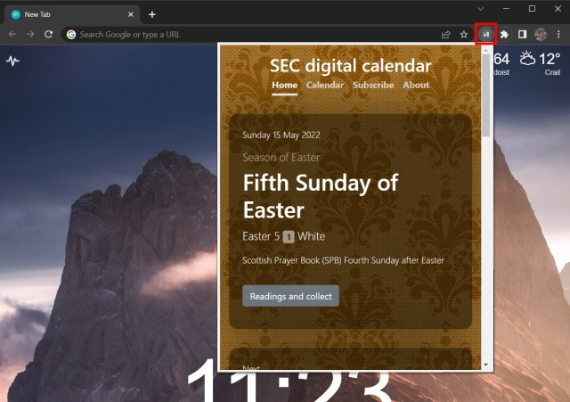

# SEC Digital Calendar Google Chrome extension

View the [Scottish Episcopal Church digital calendar and lectionary](https://www.seccalendar.org.uk/) in a popup window on your web browser's toolbar.

Save time with this handy browser extension to quickly view today's feast in a popup window on your browser's toolbar.

The button opens the full website in mobile-view in a small window, so you can access everything on this site within the toolbar popup.

Want to move everything to a full tab? Right-click a link and select 'Open link in new tab'.

## Chrome Web Store

Install this extension via the Chrome Web Store:

[SEC Digital Calendar and Lectionary](https://chromewebstore.google.com/detail/sec-digital-calendar-and/ldnfoojlojcjfkgaiimnhmnmdbnmehai)

## Manual install via Developer mode

Feel free to download it and sideload it into Chrome.

1. Download the files from this repo and unzip them to a folder on your computer.
2. In Chrome go to settings (...) > More tools > Extensions.
3. Enable "Developer mode" (toggle top right).
4. Click "Load unpacked" and locate the folder your unzipped the files to.
5. Click "Select Folder" button.
6. The extension will load locally.

